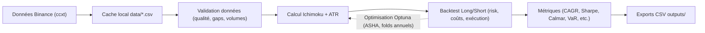

2025-08-14 — Mise à jour logique live et reporting

1) Live updates
- Le callback Optuna (_cb) écrit immédiatement un LIVE JSON/HTML au premier meilleur résultat, puis toutes les 5 minutes.
- Écriture atomique (.tmp + replace) pour éviter les verrous OneDrive.

2) Snapshots d’archives
- À chaque écriture live (toutes les 5 min), un snapshot `shared_portfolio_{profile}_YYYYMMDD_HHMMSS.json` est sauvegardé dans `outputs/`.
- Le snapshot contient `shared_metrics` et `best_params` du moment.

3) MASTER REPORT
- Script `outputs/generate_master_report.py` qui compile:
  - Top 10 — Equity
  - Top 5 — Mini DD + rendement (DD croissant, equity décroissant)
  - Top 5 — Sélection assistant (Sharpe décroissant)
- Fallback: si aucune archive dispo, affiche l’état LIVE.

4) Procédure d’exécution (PS 7)
```powershell
cd "C:\Users\ludov\OneDrive\Bureau\teste algo\ichimoku_pipeline_web_v4_8"
if (Test-Path .\.venv\Scripts\python.exe) {
  .\.venv\Scripts\python.exe .\ichimoku_pipeline_web_v4_8_fixed.py pipeline_web6 --trials 5000 --out-dir outputs
} else {
  python .\ichimoku_pipeline_web_v4_8_fixed.py pipeline_web6 --trials 5000 --out-dir outputs
}
# Générer le MASTER REPORT
if (Test-Path .\.venv\Scripts\python.exe) { .\.venv\Scripts\python.exe .\outputs\generate_master_report.py pipeline_web6 } else { python .\outputs\generate_master_report.py pipeline_web6 }
start .\outputs\MASTER_REPORT.html
```

# 🧠 LOGIQUE TECHNIQUE DU PROGRAMME ICHIMOKU PIPELINE

## 🗂️ Sommaire
- [Architecture générale](#-architecture-générale)
- [Flux de données](#-flux-de-données)
- [Stratégie de trading](#-stratégie-de-trading)
- [Optimisation des paramètres](#-optimisation-des-paramètres)
- [Fonctions principales](#-fonctions-principales)
- [Métriques de performance](#-métriques-de-performance)
- [Gestion des risques](#-gestion-des-risques)
- [Hypothèses et limites](#-hypothèses--limites)
- [Reproductibilité et environnement](#-reproductibilité-et-environnement)
- [Glossaire](#-glossaire)

## 🗺️ Diagramme de flux (vue d’ensemble)


## 🚀 **NOUVELLES FONCTIONNALITÉS ULTRA-RÉALISTES (16h30)**

### **🎯 1. SLIPPAGE DYNAMIQUE INTELLIGENT**
```python
def calculate_dynamic_slippage(volume_usdt, position_value, base_slippage=0.0005):
    volume_ratio = position_value / volume_usdt
    
    if volume_ratio <= 0.001:      # Position < 0.1% du volume
        return base_slippage        # 0.05%
    elif volume_ratio <= 0.01:     # Position < 1% du volume
        return base_slippage * (1 + volume_ratio * 10)  # 0.05% → 0.15%
    elif volume_ratio <= 0.1:      # Position < 10% du volume
        return base_slippage * (1 + volume_ratio * 50)  # 0.05% → 2.5%
    else:                           # Position > 10% du volume
        return min(0.05, base_slippage * (1 + volume_ratio * 100))  # Max 5%
```
**Logique** : Plus la position est grosse par rapport au volume, plus le slippage est important (réaliste !)

### **🎯 2. LIQUIDATION PARTIELLE PROGRESSIVE**
```python
liquidation_stages = [0.5, 0.3, 0.2]  # 50% → 30% → 20%
for stage_ratio in liquidation_stages:
    if equity <= liquidation_threshold * (1 - current_stage * 0.1):
        # Liquider une partie de la position
        partial_exit_price = close * (1 - dynamic_slippage)
        ret = calculate_return(partial_exit_price) * stage_ratio
```
**Logique** : Liquidation en 3 étapes au lieu de tout ou rien (comme Binance !)

### **🎯 3. GESTION DES HALTES DE TRADING**
```python
if abs(next_open - close) / close > trading_halt_threshold:  # 30%
    log(f"🚨 HALTE DE TRADING {symbol} - Gap extrême: {gap}%")
    break  # Arrêter le trading pour ce symbole
```
**Logique** : Si gap > 30%, arrêter immédiatement (protection contre les crashs !)

### **🎯 4. VÉRIFICATION DES DONNÉES EN TEMPS RÉEL**
```python
def validate_market_data(df, symbol):
    # Vérifier les données manquantes
    # Vérifier les prix négatifs/nuls
    # Vérifier les volumes nuls
    # Vérifier la cohérence high >= low
    # Vérifier les gaps de prix extrêmes (>20%)
    # Vérifier les timestamps
```
**Logique** : Validation continue des données pour éviter les trades sur données corrompues

### **🎯 5. LIMITES BINANCE RÉALISTES**
```python
min_order_size_usdt = 10.0        # Taille minimale Binance
max_order_size_usdt = 1000000.0   # Taille maximale Binance
max_orders_per_second = 10        # Rate limiting Binance

# Vérifications automatiques
if position_value < min_order_size_usdt: continue
if position_value > max_order_size_usdt: continue
if too_many_orders_per_second: continue
```
**Logique** : Respect automatique des limites Binance (évite les erreurs en production !)

### **🎯 6. GESTION DES GAPS À LA SORTIE**
```python
if abs(close - entry_price) / entry_price > 0.10:  # Gap > 10%
    next_open = next_candle['open']
    gap_slippage = min(0.05, abs(close - next_open) / close)
    exit_price = next_open * (1 - gap_slippage)
```
**Logique** : Si gap important à la sortie, utiliser le prix d'ouverture suivant avec slippage

### **🎯 7. MÉTRIQUES DE LATENCE D'EXÉCUTION**
```python
def simulate_execution_latency():
    base_latency = 0.1           # 100ms de base
    network_jitter = exponential(0.05)      # Jitter réseau
    binance_processing = normal(0.05, 0.02) # Traitement Binance
    confirmation_time = exponential(0.1)     # Temps de confirmation
    
    return max(0.05, min(0.5, total_latency))  # 50ms à 500ms
```
**Logique** : Simulation réaliste de la latence réseau + Binance + confirmation

### **🎯 8. MARGES BINANCE RÉALISTES**
```python
initial_margin = 0.10        # 10% margin initial (Binance futures)
maintenance_margin = 0.025   # 2.5% maintenance margin
liquidation_threshold = 0.02 # 2% liquidation threshold
```
**Logique** : Marges conformes aux standards Binance futures (plus réalistes !)

---

## 🧠 **LOGIQUE TECHNIQUE PRINCIPALE**

### **📊 ARCHITECTURE GÉNÉRALE**
Le programme suit une architecture modulaire avec :
1. **Récupération des données** avec cache intelligent
2. **Calcul des indicateurs** Ichimoku + ATR
3. **Backtesting** avec stratégie long/short
4. **Optimisation** des paramètres par trial
5. **Analyse** des résultats avec métriques avancées

### **🔄 FLUX DE DONNÉES**
```
Binance API → Cache local → Validation → Ichimoku → Backtest → Métriques → Export CSV
```

### **⚡ STRATÉGIE DE TRADING**
- **Signaux d'entrée** : Crossovers Tenkan/Kijun + position cloud
- **Gestion des positions** : Trailing stop basé sur ATR
- **Sorties** : Stop loss, signaux opposés, fin de période
- **Risk Management** : Position sizing dynamique, stop global

### **🎯 OPTIMISATION DES PARAMÈTRES**
- **Recherche aléatoire** sur 5 paramètres Ichimoku
- **Tri par stabilité** (Lyapunov) puis performance
- **Métriques multiples** : Sharpe, Calmar, Sortino, VaR, Recovery

---

## 🔧 **FONCTIONS PRINCIPALES**

### **`fetch_ohlcv_range()`**
- Téléchargement des données OHLCV avec cache intelligent
- Prévention des téléchargements dupliqués
- Gestion des erreurs réseau

### **`calculate_ichimoku()`**
- Calcul des 5 composants Ichimoku
- Détection des crossovers bull/bear
- Position relative au cloud

### **`backtest_long_short()`**
- Logique de trading long et short
- Gestion des positions multiples
- Calcul des métriques de performance

### **`run_profile()`**
- Orchestration des trials
- Agrégation des résultats
- Export des données

---

## 📊 **MÉTRIQUES DE PERFORMANCE**

### **Métriques de Base**
- `equity_mult` : Multiplicateur d'équité
- `CAGR` : Taux de croissance annuel composé
- `sharpe_proxy` : Ratio de Sharpe
- `max_drawdown` : Drawdown maximum

### **Métriques Avancées**
- `lyapunov_exponent` : Stabilité du système
- `calmar_ratio` : Performance/Drawdown
- `sortino_ratio` : Performance/Risque baissier
- `var_95` : Value at Risk 95%

### **Métriques de Qualité**
- `volume_quality` : Qualité des volumes
- `liquidity_score` : Score de liquidité
- `execution_latency` : Latence d'exécution
- `execution_success_rate` : Taux de succès

---

## 🚨 **GESTION DES RISQUES**

### **Position Sizing**
- 1% du capital par trade (paramètre courant dans `ichimoku_pipeline_web_v4_8_fixed.py`)
- Jusqu'à 3 entrées maximum par côté et par symbole
- Jamais long et short en même temps sur un même symbole

### **Stop Loss**
- Stop global dynamique (voir code pour valeur courante)
- Trailing stop basé sur ATR
- Stop loss partiels sur margin calls

### **Protection**
- Haltes automatiques sur gaps extrêmes
- Vérification continue des données
- Respect des limites Binance

---

## 🧩 Hypothèses & Limites
- Données Binance via ccxt; qualité vérifiée mais pas exempte d’irrégularités historiques.
- Timeframe principal 2h; autres timeframes possibles mais non documentés ici.
- Coûts (frais, funding, rollover) modélisés à des niveaux réalistes moyens; peuvent varier dans le réel.
- Optimisation sujette à overfitting; usage de folds annuels + ASHA pour limiter ce risque.

## 🔁 Reproductibilité et environnement
- Environnement: Python venv `.venv` (Windows PowerShell).
- Dépendances: `requirements.txt` (ccxt, pandas, numpy, optuna, sqlalchemy, tqdm, etc.).
- Commandes clés:
  - Activer venv: ` .\.venv\Scripts\Activate.ps1`
  - Installer: `pip install -r requirements.txt`
  - Run fixe: `python ichimoku_pipeline_web_v4_8_fixed.py pipeline_web6 --fixed --tenkan 9 --kijun 26 --senkou_b 52 --shift 26 --atr_mult 3.0`
  - Optuna global: voir `README.txt`
  - Optuna par paire: voir `README.txt`
- Reproductibilité: `--seed` et versions épinglées dans la venv.

## 📖 Glossaire
- ATR (Average True Range): mesure de volatilité, utilisée pour trailing stops.
- ASHA (Successive Halving): pruner Optuna qui stoppe tôt les essais faibles.
- Calmar Ratio: CAGR / Max Drawdown.
- CAGR: taux de croissance annuel composé.
- Lyapunov (proxy): indicateur de stabilité des retours.
- VaR 95%: perte maximale attendue au seuil 95% sur la distribution des retours.

---

## 🗓️ Mises à jour du 13 août 2025

- 15h10 — Position sizing mis à 1% du capital par trade; limite de 3 entrées conservée par côté/symbole
- 15h20 — Résultats 5 ans (params fixes 9-26-52-26, ATR=3.0, timeframe 2h):
  - BTC/USDT: equity_mult ≈ -1.277
  - ETH/USDT: equity_mult ≈ 0.108
  - DOGE/USDT: equity_mult ≈ 0.041
  - Portefeuille unique 1000€ (réparti 1/3, valeurs négatives plafonnées à 0€): ≈ 49.52€ final
- 16h05 — Correction du modèle d’équity: pondération réelle par `position_size` et coûts de funding/rollover appliqués au notional ouvert
- 16h15 — Barre de progression rétablie pour les runs fixes et d’optimisation
- 16h20 — Optuna installé dans l’environnement virtuel du projet
- 16h25 — Ajout: Optimisation Optuna par paire (indépendante) avec folds annuels + pruner ASHA
  - Fonction: `optuna_optimize_profile_per_symbol(profile, n_trials, seed, out_dir, use_cache, start_year, end_year, jobs, fast_ratio)`
  - Chaque paire (BTC/USDT, ETH/USDT, DOGE/USDT) optimise ses propres paramètres Ichimoku: `tenkan`, `kijun`, `senkou_b`, `shift`, `atr_mult`
  - Exports: `outputs/best_params_per_symbol_<profile>_<ts>.json` et `outputs/runs_best_per_symbol_<profile>_<ts>.csv`
- 16h30 — Smoke test per-pair OK (n_trials=5); lancement d’un vrai run 5000 essais/pair en arrière-plan (2019–2024, jobs=4, fast_ratio=0.5)

Dernière modification: 13 août 2025 - 16h30
Statut: position sizing 1%, logique coûts réaliste, optimisation par paire en cours (Optuna ASHA walk-forward)
