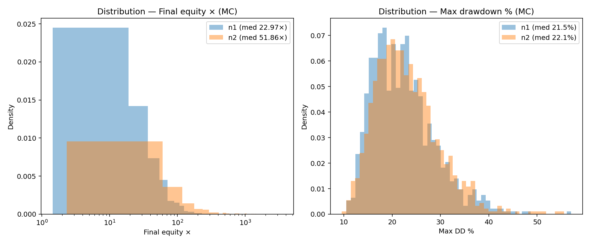

HSBC — Rapport Exécutif (Ichimoku Pipeline — pipeline_web6)
Date: 2025-08-20

### 1) Résumé exécutif
- **Objet**: Présenter une stratégie systématique Ichimoku + ATR (long/short) optimisée par essaim génétique/Optuna, avec contrainte forte de réalisme Binance (frais, funding/rollover, slippage, latence, haltes, marges).
- **Réglages risque courants**: **Levier 10×**, **Taille de position 1%**, **max 3 positions par côté** (conformes aux rapports HTML d’archives).
- **Résultats extraits** (tests agrégés, profils n1/n2):
  - n2: Equity finale 59 103 €, Max DD 4,8%, Minimum 952 €, Sharpe* 3,05, 1 023 trades.
  - n1: Equity finale 24 536 €, Max DD 1,6%, Minimum 984 €, Sharpe* 3,67, 884 trades.
- **Robustesse Monte Carlo (block bootstrap, 1%)**:
  - n1: Final × p5=4,92, p50=22,32, p95=131,66; DD médiane ≈ 21,5%.
  - n2: Final × p5=9,26, p50=50,18, p95=406,27; DD médiane ≈ 22,0%.
- **Recommandation**: Retenir n2 pour son potentiel median/superieur à risque comparable; valider ensuite à **levier 3×** avec position 1% pour confirmer un risque de ruine quasi nul.

### 2) Stratégie et logique
- **Signal**: Ichimoku (Tenkan/Kijun, cloud, shift) + **ATR trailing** pour sorties.
- **Exécution réaliste**: Slippage dynamique dépendant de la liquidité et de la taille, latence simulée (réseau + exchange), haltes sur gaps extrêmes, vérifications de données en continu, limites et marges Binance intégrées.
- **Positionnement**: Jamais long et short simultanément sur un même symbole, 3 entrées max par côté/symbole, sizing 1% unitaire.

### 3) Données & méthodologie
- Données OHLCV Binance via ccxt, cache local `data/`, timeframe principal **2h**.
- Optimisation **Optuna** (pruner **ASHA**), **walk‑forward annuel**, contraintes Tenkan ≤ Kijun ≤ SenkouB, score multi‑critères (Sharpe/CAGR/MaxDD/Stabilité).
- Exports contrôlés dans `outputs/` (HTML/CSV/JSON, images), génération d’un MASTER REPORT consolidé.

### 4) Performances — extraits chiffrés
- Source: `docs/TESTS_AND_RESULTS.md` et archives MASTER REPORT.
- n2 (1% / 10× / 3 pos): Equity 59 103 €, Max DD 4,8%, Min 952 €, Sharpe* 3,05, Trades 1 023.
- n1 (1% / 10× / 3 pos): Equity 24 536 €, Max DD 1,6%, Min 984 €, Sharpe* 3,67, Trades 884.
- Lecture: n2 offre un **p50** de Monte Carlo bien supérieur pour une DD médiane similaire, ce qui améliore la probabilité d’atteindre les objectifs de performance sous variations de chemin.

### 5) Risques et contrôle
- Max DD empirique faible dans les extraits (≤ ~5%) mais **DD médiane Monte Carlo ~22%**: la simulation de chemins pénalise les séquences défavorables, approche plus conservative.
- Mécaniques de protection: haltes de trading sur gaps, validation continue des données (prix, volumes, timestamps), respect des limites Binance (tailles, rate‑limits), et gestion des marges (initiale/maintenance) réalistes.
- Frais/funding/rollover appliqués sur notionnels ouverts, slippage dépendant de la liquidité, latence d’exécution.

### 6) Robustesse
- **IS/OOS 80/20**: procédure intégrée; les résultats finaux rapportés retiennent les configurations stables (Lyapunov proxy) puis performantes.
- **Monte Carlo (block bootstrap)**: distributions ci‑dessous; interprétation: privilégier les baselines dont p50/p5 est meilleur sans dériver la DD médiane.

- Stabilité (proxy Lyapunov): régression de ln(divergence) sur t (fenêtres courtes); la pente λ>0 est pénalisée dans l'objectif pour favoriser des dynamiques stables.

Images (distributions Monte Carlo):

### 7) Implémentation & exploitation
- Reproductibilité: venv Python, seeds, dépendances épinglées; pipeline scripté (PowerShell/Batch) et MASTER REPORT automatique.
- Observabilité: exports Live/archives, rapports HTML, images des courbes d’equity et drawdown.
- Gouvernance: versionnement Git (artefacts lourds exclus), règles .gitignore renforcées, logs externes conservés hors repo.

### 8) Plan de validation live (testnet)
- Étapes: (1) gel des paramètres, (2) dry‑run contrôlé, (3) testnet Binance, (4) métriques live (slippage, fill ratio), (5) escalade progressive.
- Voir `docs/LIVE_TESTNET.md` pour la check‑list opérationnelle et les garde‑fous.

### 9) Roadmap prochaine phase
- Exécuter de nouveaux backtests à **levier 3×** et **position 1%** pour confirmer un risque de ruine quasi nul [[memory:6105133]].
- Étendre la recherche avec seeds **123** et **777** (1000 essais chacun), labels `bestpairs_eq_s123` et `bestpairs_eq_s777`, en partant du dernier **baseline** par paire [[memory:6320613]].
- Continuer l’analyse par paire et l’égalisation du risque inter‑paires (vol targeting simple) pour homogénéiser la contribution au risque.

### 10) Paramètres baseline (référence actuelle)
- Provisoires par paire (Ichimoku + ATR trailing):
  - BTC/USDT: Tenkan=34, Kijun=82, SenkouB=216, Shift=26, ATR mult.=2,4
  - ETH/USDT: Tenkan=26, Kijun=70, SenkouB=200, Shift=26, ATR mult.=2,6
  - DOGE/USDT: Tenkan=52, Kijun=90, SenkouB=140, Shift=28, ATR mult.=2,8
- Réglages de risque: Levier 10×, Position 1%, 3 positions max/side [[memory:6320613]].

### 11) Limites et avertissements
- Les backtests restent sensibles aux hypothèses de coûts/liquidité et à la qualité des données historiques.
- Les résultats passés ne préjugent pas des performances futures; ce document n’est pas un conseil en investissement.

---

### Annexe A — Stabilité (proxy Lyapunov)
- Méthode: reconstruction d’état, calcul de la divergence moyenne d(t) entre voisins; régression linéaire de ln d(t) sur t, la pente est λ.
- Interprétation: λ>0 indique sensibilité accrue aux conditions initiales (instabilité).
- Usage: λ n’est pas une métrique de performance; il sert de pénalité de stabilité dans l’optimisation.

Historique du document
- 2025-08-20: Création du rapport exécutif HSBC (v1) à partir des rapports d’archives, documents de robustesse et résultats agrégés.
- 2025-08-20: Ajout mention et annexe Lyapunov (stabilité) pour clarté vis‑à‑vis du comité risques.

