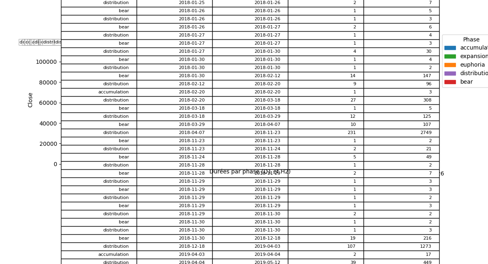

## Graphiques prix colorés par phase — BTC (USDT/USD, 2h/1d)

Référence des phases: 3‑régimes (up/down/range), 5‑phases (accumulation, expansion, euphoria, distribution, bear), 6‑phases (5 + capitulation). Lien CSV comparatif (durées, P1..P6, LFP): `docs/PHASE_LABELS/csv/comparatif_durees_fourier_halving.csv`.

### 3‑régimes (regime3)
- BTC_USDT 2h

- BTC_USDT 1d

- BTC_USD 2h

- BTC_USD 1d

### 5‑phases (phase5)
- BTC_USDT 2h

- BTC_USDT 1d

- BTC_USD 2h

- BTC_USD 1d

### 6‑phases (phase6)
- BTC_USDT 2h

- BTC_USDT 1d

- BTC_USD 2h

- BTC_USD 1d

