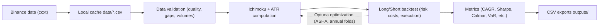

HSBC — Executive Report (Ichimoku Pipeline — pipeline_web6)
Date: 2025-08-20

### 1) Executive summary
- Purpose: Present a systematic Ichimoku + ATR (long/short) strategy optimized with Optuna (genetic/successive halving flavor) under realistic Binance constraints (fees, funding/rollover, slippage, latency, halts, margins).
- Current risk settings: Leverage 10×, Position size 1%, up to 3 entries per side (consistent with HTML master reports).
- Highlighted results (aggregated tests, sets n1/n2):
  - n2: Final equity €59,103; Max DD 4.8%; Minimum €952; Sharpe* 3.05; Trades 1,023.
  - n1: Final equity €24,536; Max DD 1.6%; Minimum €984; Sharpe* 3.67; Trades 884.
- Monte Carlo robustness (block bootstrap, 1% position):
  - n1: Final × p5=4.92, p50=22.32, p95=131.66; median DD ≈ 21.5%.
  - n2: Final × p5=9.26, p50=50.18, p95=406.27; median DD ≈ 22.0%.
- Recommendation: prefer n2 for its superior median/potential at similar median DD; then validate at 3× leverage and 1% position for near‑zero ruin risk confirmation.

### 2) Strategy and logic
- Signals: Ichimoku (Tenkan/Kijun, cloud, shift) + ATR trailing for exits.
- Realistic execution: dynamic slippage as a function of liquidity and order size, simulated latency (network + exchange), trading halts on extreme gaps, continuous data validation, Binance limits & margins enforced.
- Positioning: never long and short simultaneously on the same symbol; up to 3 entries per side; unit position size 1%.

### 3) Data & methodology
- OHLCV data from Binance via ccxt, local cache in `data/`, primary timeframe 2h.
- Optimization with Optuna (ASHA pruner), annual walk‑forward, constraints Tenkan ≤ Kijun ≤ SenkouB, multi‑metric score (Sharpe/CAGR/MaxDD/Stability).
- Controlled exports in `outputs/` (HTML/CSV/JSON, images), consolidated MASTER REPORT generation.
- Formulas and examples (LaTeX): see `docs/FORMULAS_AND_EXAMPLES.md`.

Flow diagram (overview):

### 4) Performance — selected figures
- Source: `docs/TESTS_AND_RESULTS.md` and archived MASTER REPORTs.
- n2 (1% / 10× / 3 pos): Equity €59,103; Max DD 4.8%; Min €952; Sharpe* 3.05; Trades 1,023.
- n1 (1% / 10× / 3 pos): Equity €24,536; Max DD 1.6%; Min €984; Sharpe* 3.67; Trades 884.
- Reading: n2 shows a much better Monte Carlo median p50 at similar median DD, improving odds of achieving targets across path variations.

Charts (sample):

### 5) Risks and controls
- Empirical Max DD in the extracts is low (≤ ~5%) but MC median DD is ~22%: bootstrapped paths penalize adverse sequences — conservative view.
- Protections: trading halts on extreme gaps, continuous data validation (prices, volumes, timestamps), enforcement of Binance limits (sizes, rate‑limits), realistic initial/maintenance margins.
- Costs: fees/funding/rollover applied to open notionals; liquidity‑dependent slippage; execution latency.

### 6) Robustness
- IS/OOS 80/20: integrated; final configurations favor stability (Lyapunov proxy) then performance.
- Monte Carlo (block bootstrap): distributions below; interpretation: prefer baselines whose p50/p5 is better without worsening the median DD.

Images (Monte Carlo distributions):

### 7) Implementation & operations
- Reproducibility: Python venv, seeds, pinned dependencies; scripted pipeline (PowerShell/Batch) and automatic MASTER REPORT.
- Observability: Live/archives exports, HTML reports, equity and drawdown charts.
- Governance: Git versioning (heavy artifacts excluded), reinforced .gitignore rules, heavy logs stored outside the repo.

### 8) Live validation plan (testnet)
- Steps: (1) freeze parameters, (2) controlled dry‑run, (3) Binance Testnet, (4) live metrics (slippage, fill ratio), (5) gradual scale‑up.
- See `docs/LIVE_TESTNET.md` for the operational checklist and safeguards.

### 9) Next‑phase roadmap
- Run new backtests at 3× leverage and 1% position to validate near‑zero ruin risk.
- Extend the search with seeds 123 and 777 (1,000 trials each), labels `bestpairs_eq_s123` and `bestpairs_eq_s777`, starting from the latest per‑pair baseline.
- Continue per‑pair analysis and simple vol‑targeting to balance risk contribution across pairs.

### 10) Baseline parameters (current reference)
- Provisional per pair (Ichimoku + ATR trailing):
  - BTC/USDT: Tenkan=34, Kijun=82, SenkouB=216, Shift=26, ATR mult.=2.4
  - ETH/USDT: Tenkan=26, Kijun=70, SenkouB=200, Shift=26, ATR mult.=2.6
  - DOGE/USDT: Tenkan=52, Kijun=90, SenkouB=140, Shift=28, ATR mult.=2.8
- Risk settings: Leverage 10×, Position 1%, up to 3 positions per side.

### 11) Limitations and disclaimers
- Backtests remain sensitive to cost/liquidity assumptions and historical data quality.
- Past performance is not indicative of future results; this document is not investment advice.

---

### Annex A — Stability (Lyapunov proxy)
- Method: state‑space reconstruction, mean neighbor divergence d(t); linear regression of ln d(t) versus t; slope is λ.
- Interpretation: λ>0 indicates higher sensitivity to initial conditions (instability).
- Usage: λ is not a performance metric; it is used as a stability penalty in optimization.

Document history
- 2025-08-20: Initial English executive report (v1) derived from archives, robustness docs and aggregated results.

